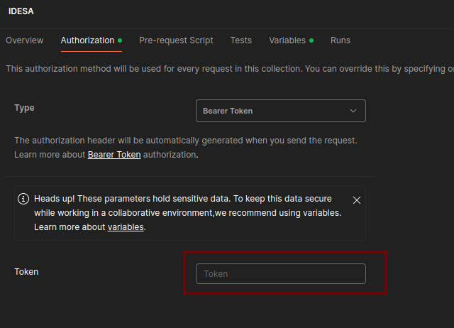
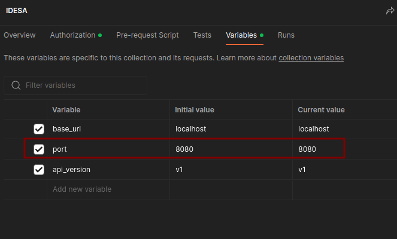

## IDESA Test1
### 1. Clonar el repo
```bash
git clone https://github.com/carlosalemanlima/idesa.git
```

### 2. Configuraciones
En el fichero `docker-compose.yml` se deben configurar los puertos para el servidor de aplicaciones (por defecto `8080`) y el servidor de bases de datos (por defecto `3309`).

```yml
#docker-compose.yml
...

database:
    container_name: idesa-db
    restart: unless-stopped
    image: mysql:8.0.27
    volumes:
      - v-database:/var/lib/mysql
    ports:
      - "3309:3306" #configurar puerto a usar, por defecto 3309

...

laravel:
    restart: unless-stopped
    container_name: idesa-app
    build:
      context: ./
      dockerfile: ./Dockerfile
    volumes:
      - v-idesa-app:/var/www/html/storage/app
    ports:
      - "8080:80" #configurar puerto a usar, por defecto 8080

```

### 3. Desplegar Servicios
```bash
docker compose up -d
```
> Verificar que se despliegan los dos servicios `idesa-app` e `idesa-db`

```bash
docker ps
```

### 4. Ejecutar migrations
```bash
docker exec -it idesa-app php artisan migrate
```

### 5. Ejecutar seeds
```bash
docker exec -it idesa-app php artisan db:seed
```
> Para agilizar el proceso de test del repo, ejecutar seed crea un usuario por defecto con las credenciales: \
> `user:` idesa \
> `password:` idesa123

### 6. Ejecutar tests
```bash
docker exec -it idesa-app php artisan test
```

## Probar el API
Para testear el API podemos importar la colección de Postman que se encuentra en `postman/IDESA.postman_collection.json`

### Autenticación
Para generar una `API key` debemos usar el endpoint de login con las credenciales por defecto o crear un usuario y hacer login.

Luego de esto, todos los request podemos hacerlos usando esta `API key` colocando el encabezado de Authorization Bearer. Ejemplo:
``` bash
curl http://localhost:8080/api/v1/books  -H "Authorization: Bearer api_key"
```

Para usarlo desde Postman podemos configurar el Token a usar en el apartado de Authorization de la colección.




### Otros aspectos a tener en cuenta
En caso de cambiar el puerto por defecto del servidor de aplicaciones, se debe configurar dicha variable en la colección



>Importante: Con el objetivo de agilizar el proceso de prueba de este repo, se incluyó el fichero `.env` con todas las configuraciones necesarias para solo desplegar la aplicación de forma rápida y fácil pero se considera una mala práctica incluir ficheros de configuraciones de este tipo con información sensible en los repositorios de código.
